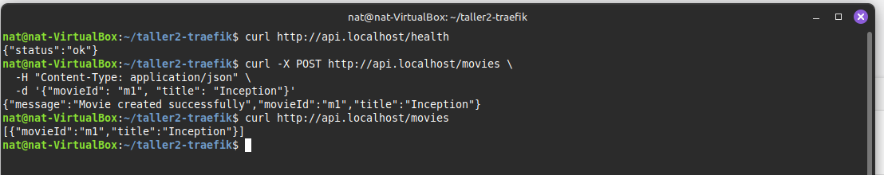

# Taller Gateway de servicios con Traefik

## Integrantes

- Sebastián Cañon Castellanos
- Natalia Bernal Pulido

## Requisitos

- Docker y Docker Compose instalados.
- Añadir dominios locales a `/etc/hosts`.

## 1. Topología y Redes

#### Verificación de Hosts

**Comando:** Para este caso creamos un script que hacía el seteo de los hosts, es un script sh `\setup-hosts.sh`

#### Construcción con 2 Réplicas

**Comando:** `docker-compose up --build --scale flask_api=2 -d`

## 2. Rutas estructuradas

## 3. Middlewares

**Comando:** `for i in {1..50}; do curl -s -o /dev/null -w "Status: %{http_code}\n" http://api.localhost/health & done 2>/dev/null; wait`

## 4. Balanceo(2 réplicas de la api)

Como se observa para la imagen de flask hay 2 replicas:

## 5. Descubrimiento automático

## 6. Pruebas

**Rutas Flask API:**

**Routers:**

**Services:**

**Middlewares:**

# Entregables equipo

## Diagrama de la solución

## Hosts Configurados

Para el funcionamiento del proyecto, se configuraron los siguientes hosts en `/etc/hosts`:

- `api.localhost` - API Flask
- `ops.localhost` - Dashboard de Traefik

## Checklist de comprobaciones

- API en api.localhost responde /health.
  

- Dashboard accesible solo en ops.localhost/dashboard/ y con
  auth.
  

- Servicios y routers visibles en el dashboard.
  **Services:**
  

  **Routers:**
  

- Rate-limit o stripPrefix aplicado y verificado.
  **Comando para probar rate-limit:** `for i in {1..50}; do curl -s -o /dev/null -w "Status: %{http_code}\n" http://api.localhost/health & done 2>/dev/null; wait`
  

- Balanceo entre 2 réplicas evidenciado
  **Comando:** `docker-compose up --build --scale flask_api=2 -d`
  

## Reflexión

### ¿Qué aporta Traefik frente a mapear puertos directamente?

Traefik ofrece un descubrimiento automático de servicios que permite detectar nuevos contenedores sin necesidad de configuración manual. Mientras que mapear puertos requiere definir cada puerto específico para cada servicio, Traefik maneja todo esto automáticamente. También proporciona balanceamiento de carga integrado que distribuye las peticiones entre múltiples instancias del mismo servicio. Además, incluye middlewares ya desarrollados para autenticación, limitación de velocidad y terminación SSL, lo que simplifica la implementación de estas funcionalidades. La gestión se centraliza en un solo punto de entrada, eliminando la necesidad de recordar múltiples puertos. Por último, el escalamiento de servicios es automático, ya que Traefik detecta nuevas réplicas sin intervención manual.

### ¿Qué middlewares usarían en producción?

En un ambiente de producción sería importante usar HTTPS Redirect para forzar todas las conexiones a ser seguras. El manejo de CORS es necesario para aplicaciones web que reciben peticiones desde diferentes dominios. La compresión con Gzip o Brotli ayuda a mejorar el rendimiento reduciendo el tamaño de las respuestas. Un Circuit Breaker previene fallos en cascada cuando un servicio está sobrecargado. La restricción de acceso por IP puede limitar quién puede acceder a ciertos servicios. La manipulación de cabeceras permite añadir o quitar información de las peticiones y respuestas. Los reintentos automáticos ayudan a manejar fallos temporales de red.

### Riesgos de dejar el dashboard "abierto"

Dejar el dashboard de Traefik accesible sin protección expone información sobre la arquitectura interna del sistema, incluyendo qué servicios están ejecutándose y cómo están configurados. Esto crea una superficie de ataque adicional que los atacantes pueden explotar para obtener información sensible. También existe el riesgo de que alguien no autorizado pueda acceder a las configuraciones y modificar el comportamiento del proxy. Para mitigar estos riesgos se puede implementar autenticación básica como se hizo en este proyecto, restringir el acceso solo a través de VPN, usar listas blancas de IP, deshabilitar completamente el dashboard en producción, monitorear todos los accesos al dashboard y usar certificados TLS para encriptar la comunicación.
